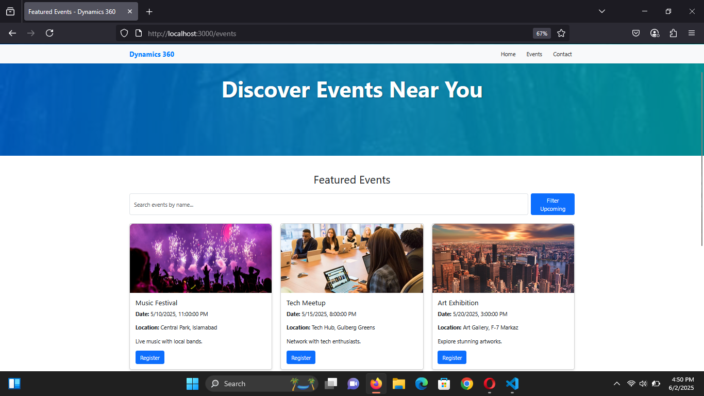
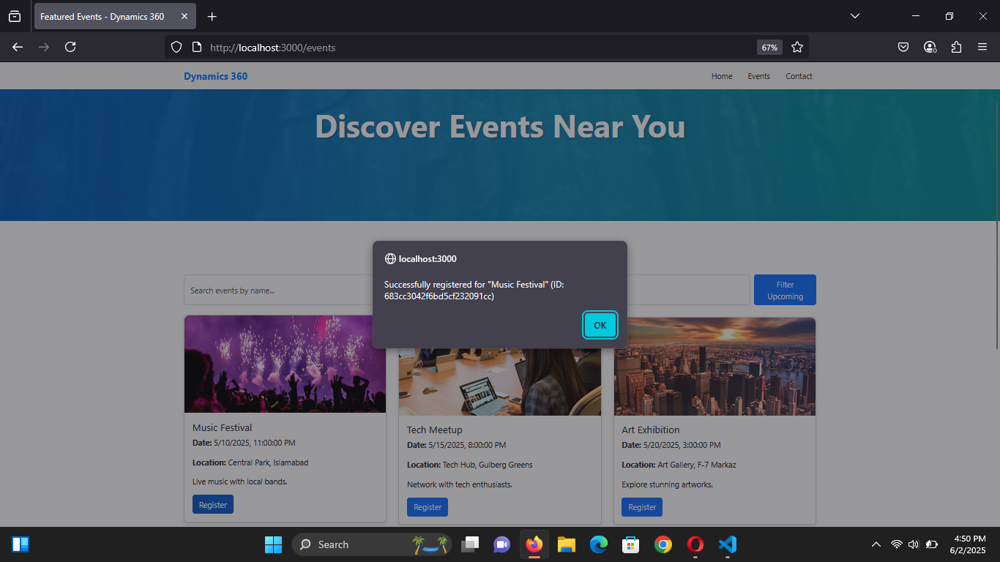
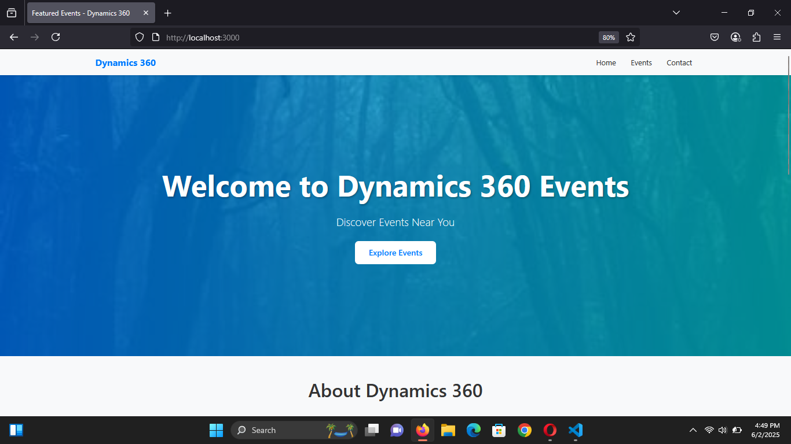

Featured Events Page - Dynamics 360 Internship Case Study Overview This project is a full-stack, responsive "Featured Events" webpage developed for the Dynamics 360 Web Development Internship Case Study. It features a modern, mobile-friendly UI with a MongoDB backend for dynamic event management, simulated JWT-based registration, and advanced filtering capabilities. Technologies Used Frontend

React 18.3.1: Component-based UI. React-Bootstrap 5.3.3: Responsive styling. Axios: API requests. CSS3: Custom styling (hover effects, gradients).

Backend

Node.js & Express: Robust API server. MongoDB (Atlas): Event data storage. Mongoose: Schema modeling. JSON Web Token (JWT): Simulated user registration. CORS & Dotenv: Secure API communication.

Deployment

Backend: Vercel (https://dynamics360-events-page-l9d7.vercel.app) Frontend: Netlify (https://usama-jamshed-app.netlify.app) GitHub: https://github.com/Usama6270/dynamics360-events-page

Features

Responsive Navigation Bar: Features links to "Home," "Events," and "Contact" with a mobile-friendly hamburger menu. Hero Section: Displays "Discover Events Near You" with a gradient background. Featured Events Section: Dynamically fetches and displays 4+ event cards from MongoDB. Includes event name, date/time (formatted using toLocaleString), location, description, and a "Register" button with simulated JWT-based authentication.

Search Bar: Enables real-time filtering of events by name. Date Filter: Provides a button to filter upcoming events (dates >= today). Enhanced UI: Incorporates smooth hover effects, responsive card layout, event-specific images, and a professional footer across all pages. About Us Section: Showcases team profiles with circular-framed images.

Setup Instructions

Clone the Repository:git clone https://github.com/Usama6270/dynamics360-events-page.git

Backend Setup: Navigate to the backend directory and install dependencies:cd backend npm install

Start the backend server:npm start

Frontend Setup: Navigate to the frontend directory and install dependencies:cd frontend npm install

Start the frontend application:npm start

Live Preview

Frontend: https://usama-jamshed-app.netlify.app Events Page: https://usama-jamshed-app.netlify.app/events Backend: https://dynamics360-events-page-l9d7.vercel.app GitHub Repository: https://github.com/Usama6270/dynamics360-events-page

Bonus Features Implemented

MongoDB Integration: Enables dynamic event fetching from MongoDB Atlas for scalability. JWT Authentication: Implements simulated registration with JWT tokens for secure interactions. Date Filter: Enhances user experience by filtering events to show only upcoming ones. Professional UI: Features a modern design with hover effects, responsive layout, and consistent styling.

Notes

This project exceeds the internship requirements by implementing a full MERN stack with simulated authentication and advanced filtering. Deployment is optimized on Vercel (backend) and Netlify (frontend) for seamless accessibility.

Contact For questions, please contact hr@dynamics360.net. Submitted by: Usama Jamshed Submission Date: June 2, 2025 For: Dynamics 360 Web Development Internship

Screenshot:

